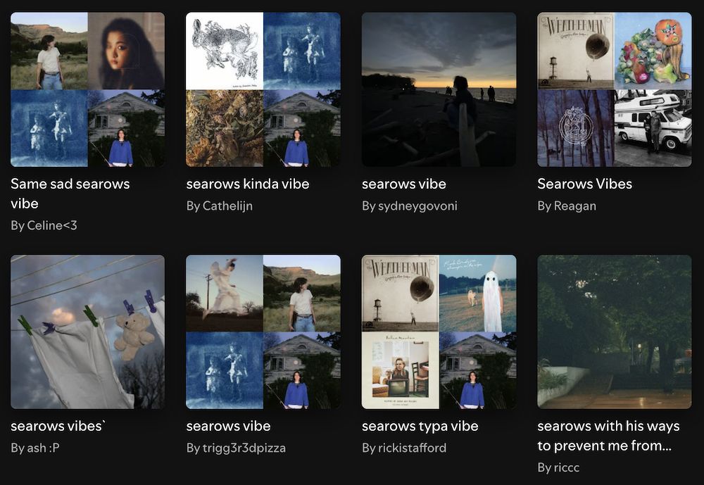

Music plays an important part in my life the way it does for many of us. 
[I struggle to bond deeply with people who don't care about music](https://www.goodreads.com/quotes/7132910-i-m-suspicious-of-people-who-don-t-like-dogs-but-i). In my life writing, making, and listening to music have always been intertwined. On this page, you may learn more about the music I consume.

### How I listen
Having grown up with cassette tapes, burned CDs, and LimeWire MP3s, I now listen to music through my paid Spotify subscription. Aware of the ethical and political considerations, I make daily use of the service, and use it as a central archive of the records I've listened to since the late eighties.

### Discovering new music
I do not use Spotify's "Made For You" playlists. Instead, I look for user-created playlists, usually by searching for `artist name` + `vibe`, or `mixtape mmyy`.

In addition, I enjoy reading the work of music critics, especially outside of their regular context of a magazine or other publication. Lastly, I enjoy how people like [Chris Glass](https://chrisglass.com/) and others feature songs they're listening to.

### Listening to favorites

I treat user-created playlists as mixtapes users made for people like me. I'll listen for songs I like, and then go from there. Beyond that, my listening habits are **album-centered**, and not playlist-centered. I'm trying to make an effort to make music less decorative, so I tend to avoid playlists like "coffee house tunes" or "workout jams".

The repeat feature is set to `off` by default, making it so that I have to make a conscious choice about what to listen to next, and to give myself the reminder that I've listening to work created by a person, just like when I used to listen to physical records.

For each month and year, I create a mixtape playlist featuring my favorites from that period.

### Cataloguing

I have a [Last.fm Pro account](https://www.last.fm/user/zinzywg) which has been tracking my listening habits since 2006. It is a profound sadness in my life that I neglected to use it's Scrobbler feature between 2008 and 2018. It has left a decade-long gap which I will never be able to fill. 

Because I believe that [tools do not matter](/garden/tools-do-not-matter), I create an annual export of my Last.fm data which I store in a large Excel file. This way, my listening data can stay with me as long as I have access to a piece of software that can read Excel files.